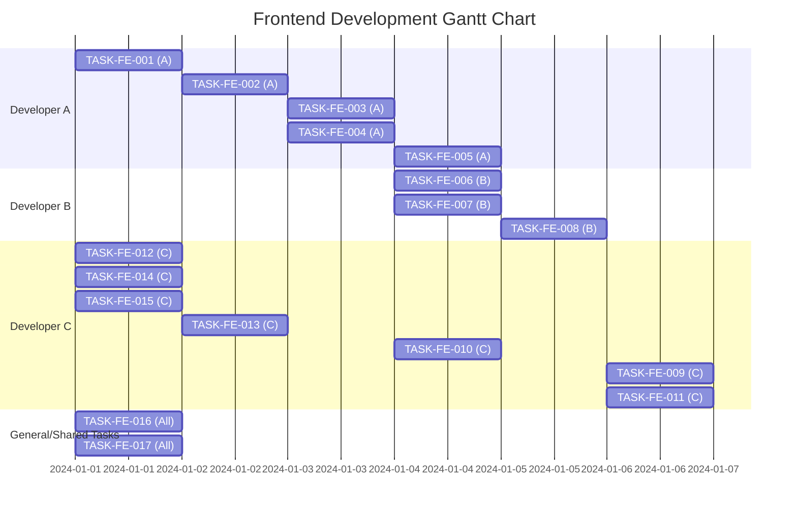

# Frontend Development Gantt Chart

This Gantt chart visualizes the task dependencies and potential timeline for the frontend development tasks outlined in `FRONTEND_BACKLOG.md`.

**Assumptions:**
*   Each task has a default duration of **1 day**.
*   The project start date is assumed to be **2024-01-01**.
*   Tasks are assigned to developers as per the backlog. Tasks under "General/Shared Tasks" are assigned to "All".
*   The chart shows the earliest possible start time for each task based on its dependencies.

**How to read:**
*   Each bar represents a task.
*   Tasks are grouped by the assigned developer.
*   The timeline at the top indicates dates.
*   Dependencies are implicitly handled by the start dates of the tasks.

